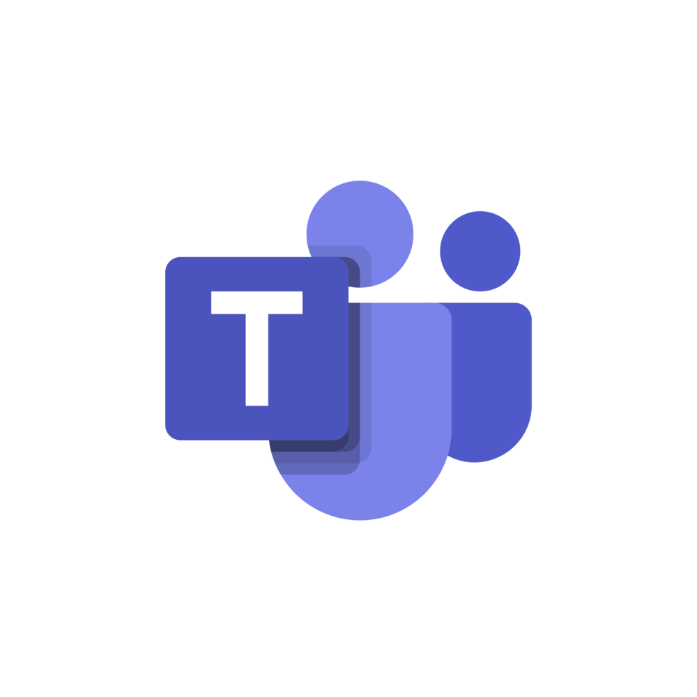

  
  <b> Microsoft Teams BOT</b>

  

  
<h4>This is a  Microsoft Teams BOT which is used for Hiring Manager persona and update all the Information of Interviews </h4>
<h4>As we all live all busy life This Bot will save a lot of time for Hiring Manager the Bot will notify the user </h4>
<h4>All the update in a summrised manner </h4>

<h3> This will be the first Message  When the person will Interact first time with the Bot, User has to Authenticate himself in Microsoft portal until that User can not move forward</h3>

<h3> After the User Authenticate , The BOT will drop a new Message which will have two views. Which user can Interact with 
   1.  View Application Summary 
   2.  Interview Schedule     
</h3>

<h3>User can have  a high class Inteactive view with the BOT Application Summary view , It contains ALL the Summary About the Requsition , the Requisition ID and User can Provide  feedback and View The Resume of the candidate. </h3>

<h3>User can View The Resume of the candidate, He can even View Candidate Skills without even opening the Candidate Resume</h3>
<h3> Hiring Manager can only View the Resume and can't download it because it would be a breach of Intformation thats why Canddiate is in view mode only</h3>

<h3>Interview Scheduled will be Shown in a Carousel manner every page will contain , Interview Schdeule for the Next seven days for every Requsition  </h3>

